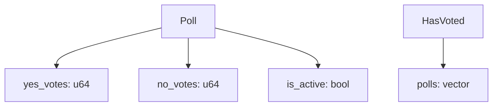

<div align="center">

# 🗳️ Aptos Voting Poll Smart Contract

[](https://aptoslabs.com/)
[](https://move-language.github.io/move/)
[](https://explorer.aptoslabs.com/txn/0x5a2e506803903da48638a66539e14a79a76f51147d94d517536944c00a852d26?network=devnet)

_A decentralized voting poll system built on the Aptos blockchain with built-in duplicate vote prevention_

[🔗 View on Explorer](https://explorer.aptoslabs.com/txn/0x5a2e506803903da48638a66539e14a79a76f51147d94d517536944c00a852d26?network=devnet) • [📖 Documentation](#documentation) • [🚀 Quick Start](#development-setup)

</div>

---

## ✨ Features

<table>
  <tr>
    <td align="center">🏗️</td>
    <td><strong>Create Polls</strong><br/>Users can create new voting polls instantly</td>
  </tr>
  <tr>
    <td align="center">🗳️</td>
    <td><strong>Vote on Polls</strong><br/>Cast yes/no votes on active polls securely</td>
  </tr>
  <tr>
    <td align="center">🔒</td>
    <td><strong>Duplicate Prevention</strong><br/>Each address can only vote once per poll</td>
  </tr>
  <tr>
    <td align="center">⚙️</td>
    <td><strong>Poll Management</strong><br/>Polls can be activated/deactivated by creators</td>
  </tr>
  <tr>
    <td align="center">⚡</td>
    <td><strong>Gas Efficient</strong><br/>Optimized for minimal transaction costs</td>
  </tr>
</table>

## 🏗️ Smart Contract Architecture

### 📊 Core Structs



<details>
<summary><strong>📋 Poll Struct</strong></summary>

- `yes_votes`: Number of yes votes
- `no_votes`: Number of no votes
- `is_active`: Poll activation status

</details>

<details>
<summary><strong>👥 HasVoted Struct</strong></summary>

- `polls`: Vector of poll addresses the user has voted on

</details>

### 🔧 Functions

| Function      | Description                      | Parameters                                            |
| ------------- | -------------------------------- | ----------------------------------------------------- |
| `create_poll` | Creates a new voting poll        | `creator: &signer`                                    |
| `vote`        | Casts a vote on an existing poll | `voter: &signer, poll_owner: address, vote_yes: bool` |

### ⚠️ Error Codes

| Code | Constant            | Description                            |
| ---- | ------------------- | -------------------------------------- |
| `1`  | `E_POLL_NOT_ACTIVE` | Poll is not currently active           |
| `2`  | `E_ALREADY_VOTED`   | Address has already voted on this poll |

## 🚀 Deployment Information

<div align="center">

### ✅ Successful Deployment

<table>
  <tr>
    <td><strong>🆔 Transaction Hash</strong></td>
    <td><code>0x5a2e506803903da48638a66539e14a79a76f51147d94d517536944c00a852d26</code></td>
  </tr>
  <tr>
    <td><strong>🌐 Network</strong></td>
    <td>Devnet</td>
  </tr>
  <tr>
    <td><strong>📊 Status</strong></td>
    <td>✅ Executed successfully</td>
  </tr>
  <tr>
    <td><strong>⛽ Gas Used</strong></td>
    <td>2,183 units</td>
  </tr>
  <tr>
    <td><strong>💰 Gas Price</strong></td>
    <td>100 units</td>
  </tr>
  <tr>
    <td><strong>👤 Sender</strong></td>
    <td><code>dfff2205e6efabcbc91c6b6c0670f1d3626482a0185e8c782fc17e9efdcbfad6</code></td>
  </tr>
  <tr>
    <td><strong>📈 Version</strong></td>
    <td>27,893,047</td>
  </tr>
  <tr>
    <td><strong>⏰ Timestamp</strong></td>
    <td>1754650123970118 (microseconds)</td>
  </tr>
</table>

</div>

## 📚 Usage Examples

### 🆕 Creating a Poll

```move
// 🏗️ Call create_poll function with signer
MyModule::VotingPoll::create_poll(&signer);
```

### 🗳️ Voting on a Poll

```move
// ✅ Vote 'yes' on a poll
MyModule::VotingPoll::vote(&voter_signer, poll_creator_address, true);

// ❌ Vote 'no' on a poll
MyModule::VotingPoll::vote(&voter_signer, poll_creator_address, false);
```

## 📁 Project Structure

```
📦 y:\College\aptos-blockchain\
├── 📂 sources/
│   └── 📄 anything.move          # Main voting poll smart contract
├── 📄 README.md                  # This beautiful file
└── 📄 Move.toml                  # Move package configuration
```

## 🛠️ Development Setup

<div align="center">

```bash
# 1️⃣ Install Aptos CLI
curl -fsSL "https://aptos.dev/scripts/install_cli.py" | python3

# 2️⃣ Initialize Aptos account
aptos init

# 3️⃣ Compile the contract
aptos move compile

# 4️⃣ Deploy to devnet
aptos move publish
```

</div>

## 🔐 Security Features

<div align="center">

| 🛡️ Feature               | 📝 Description                                                 |
| ------------------------ | -------------------------------------------------------------- |
| **Access Control**       | Only poll creators can modify poll status                      |
| **Duplicate Prevention** | Built-in checks prevent multiple votes from same address       |
| **State Validation**     | Ensures polls are active before accepting votes                |
| **Resource Management**  | Proper Move resource handling with `key` and `store` abilities |

</div>

## ⚡ Gas Optimization

> **Why our contract is efficient:**

- 🗂️ Efficient data structures
- 💾 Minimal storage operations
- 🎯 Optimized vote tracking mechanism

## 🚧 Future Enhancements

- [ ] ⏰ Add poll expiration timestamps
- [ ] 📊 Implement poll result querying functions
- [ ] 🔑 Add poll creator permissions for closing polls
- [ ] 🎯 Support for multiple choice polls
- [ ] 💎 Vote weight based on token holdings

## 📄 License

<div align="center">

This project is part of a **college blockchain development course**.

---

<table>
  <tr>
    <td align="center"><strong>🌐 Network</strong></td>
    <td align="center"><strong>📦 Module</strong></td>
    <td align="center"><strong>📅 Last Updated</strong></td>
  </tr>
  <tr>
    <td align="center">Aptos Devnet</td>
    <td align="center">MyModule::VotingPoll</td>
    <td align="center">January 2025</td>
  </tr>
</table>

**Made with ❤️ for the Aptos ecosystem**

</div>
